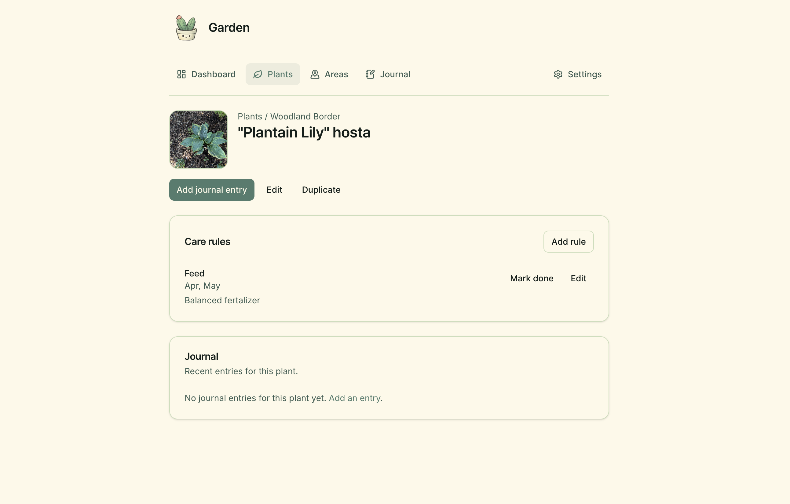

# Garden



**Live:** [garden.joescript.io](https://garden.joescript.io) · Preview: [garden-dev.joescript.io](https://garden-dev.joescript.io)  
**Package:** `@joescript/garden`

## Purpose

A shared journal for one household’s garden.

Without a written record it was hard to know what the garden needed each month. Garden keeps plants, areas, care rules, and photos in one place, and surfaces jobs due this month on the home page.

The live journal needs a sign-in (Google, allow-listed emails).

## Architecture

React Router on Cloudflare Workers, with Turso for the journal and R2 for photos. Optional Perenual species lookup; iNaturalist images without an API key.

| Concern | Where |
|---------|--------|
| Schema | `app/db/schema/` |
| Services | `app/services/` (plants, journal, photos, lookups) |
| Env validation | `app/lib/env.server.ts` |
| Auth + allow list | `app/lib/auth.server.ts`, routes under `admin/allowed-emails` |
| Worker entry | `workers/app.ts` |

**Bindings** (`wrangler.jsonc`): `PHOTOS` (R2: `garden-photos-dev` / `garden-photos-prod`).

New Google accounts cannot use the app until their email is on the allow list (admin UI after an existing allowed user signs in).

## Decisions

### Journal first, reminders second

A calendar of jobs would be easier to schedule and would hide what actually happened in the garden.

### Photos stay in the household

A public gallery would be easier to share and wrong for a home garden.

## Setup

**Requires:** Node 24+, pnpm 11.7, a Turso database, Google OAuth client, R2 bucket.

```bash
pnpm install
pnpm dev:garden
```

### `.dev.vars`

| Variable | Required |
|----------|----------|
| `TURSO_DATABASE_URL` | yes |
| `TURSO_AUTH_TOKEN` | usually |
| `BETTER_AUTH_SECRET` | yes (min 32 chars) |
| `BETTER_AUTH_URL` | yes — local origin, e.g. `http://localhost:5173` |
| `GOOGLE_CLIENT_ID` | yes |
| `GOOGLE_CLIENT_SECRET` | yes |
| `PERENUAL_API_KEY` | no — enables Perenual species search |

### Google OAuth redirect URIs

- `http://localhost:5173/api/auth/callback/google`
- `https://garden-dev.joescript.io/api/auth/callback/google`
- `https://garden.joescript.io/api/auth/callback/google`

Deployed `BETTER_AUTH_URL` lives in `wrangler.jsonc`. Other secrets: `wrangler secret put` (or GitHub environment secrets for Actions).

### Database

```bash
pnpm db:generate
pnpm db:migrate          # .env.migrate.dev / GARDEN_MIGRATE_ENV
pnpm db:migrate:prod
pnpm db:studio
```

### Useful scripts

| Script | Purpose |
|--------|---------|
| `dev` / `build` / `typecheck` / `test` | Day-to-day |
| `deploy` / `deploy:prod` | `garden-dev` / `garden.joescript.io` |

Domains, DNS, and OAuth: [`docs/domains.md`](docs/domains.md). Dev uses `garden-dev.joescript.io` (not `dev.garden.*`) for free-plan SSL.

## Live link

- **Production:** https://garden.joescript.io
- **Preview:** https://garden-dev.joescript.io
- **Portfolio:** https://joescript.io/work/garden
- **Source:** [`apps/garden`](https://github.com/BanJoeH/joescript/tree/main/apps/garden)
