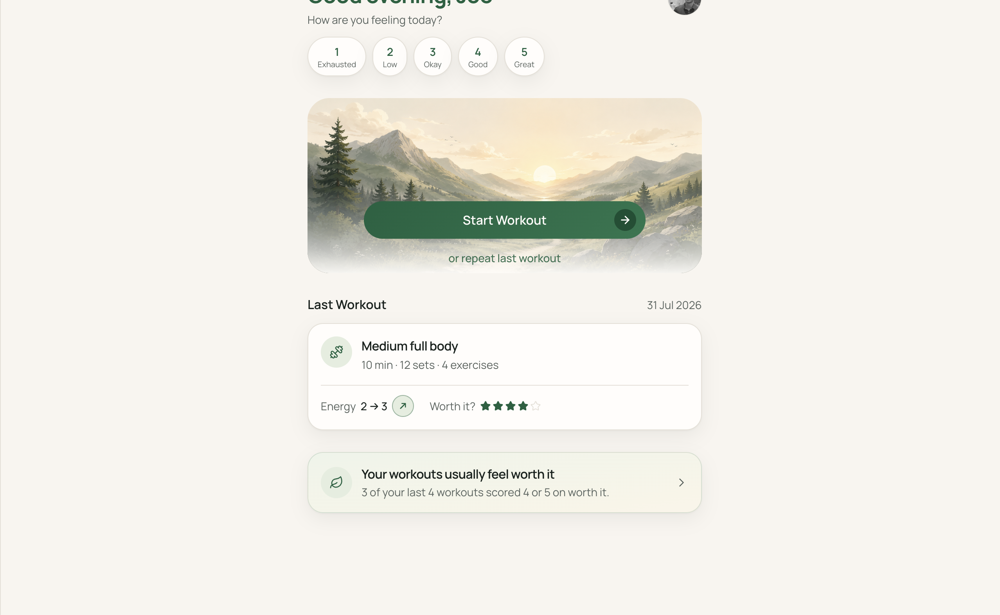

# Momentum



**Live:** [momentum.joescript.io](https://momentum.joescript.io) · Preview: [momentum-dev.joescript.io](https://momentum-dev.joescript.io)  
**Package:** `@joescript/momentum`

## Purpose

A workout journal that remembers how it felt, not only what you did.

Workouts used to live in handwritten notepads that were hard to read across weeks. Momentum stores the session, the work, how the day felt, and whether it was worth repeating — without streaks.

The live journal needs a sign-in (Google, allow-listed emails).

## Architecture

React Router on Cloudflare Workers, with Turso for the journal and Google for sign-in. Charts use Recharts. No R2 or Workers AI in the current MVP.

| Concern | Where |
|---------|--------|
| Schema | `app/db/schema/momentum.ts` |
| Insights | `app/services/insights.engine.ts` |
| Env validation | `app/lib/env.server.ts` |
| Auth + allow list | `app/lib/auth.server.ts`, routes under `admin/allowed-emails` |
| Product vision / mocks | `specs/` |
| Worker entry | `workers/app.ts` |

New Google accounts need an allow-listed email before they can sign in.

## Decisions

### No streaks

A streak punishes a missed day. Making it easy to return after a miss mattered more than an unbroken count.

### Ask whether it was worth it

A performance chart answers a different question. Worth-it is the reminder that the hard start usually pays off.

## Setup

**Requires:** Node 24+, pnpm 11.7, a Turso database, Google OAuth client.

```bash
pnpm install
pnpm dev:momentum
```

### `.dev.vars`

| Variable | Required |
|----------|----------|
| `TURSO_DATABASE_URL` | yes |
| `TURSO_AUTH_TOKEN` | usually |
| `BETTER_AUTH_SECRET` | yes (min 32 chars) |
| `BETTER_AUTH_URL` | yes — local origin, e.g. `http://localhost:5173` |
| `GOOGLE_CLIENT_ID` | yes |
| `GOOGLE_CLIENT_SECRET` | yes |

### Google OAuth redirect URIs

- `http://localhost:5173/api/auth/callback/google`
- `https://momentum-dev.joescript.io/api/auth/callback/google`
- `https://momentum.joescript.io/api/auth/callback/google`

Deployed `BETTER_AUTH_URL` is in `wrangler.jsonc`. Remaining secrets via `wrangler secret put` or GitHub environments.

### Database

```bash
pnpm db:generate
pnpm db:migrate          # .env.migrate.dev / MOMENTUM_MIGRATE_ENV
pnpm db:migrate:prod
pnpm db:studio
```

### Useful scripts

| Script | Purpose |
|--------|---------|
| `dev` / `build` / `typecheck` / `test` | Day-to-day |
| `deploy` / `deploy:prod` | `momentum-dev` / `momentum.joescript.io` |

Domains and OAuth: [`docs/domains.md`](docs/domains.md).

## Live link

- **Production:** https://momentum.joescript.io
- **Preview:** https://momentum-dev.joescript.io
- **Portfolio:** https://joescript.io/work/momentum
- **Source:** [`apps/momentum`](https://github.com/BanJoeH/joescript/tree/main/apps/momentum)
