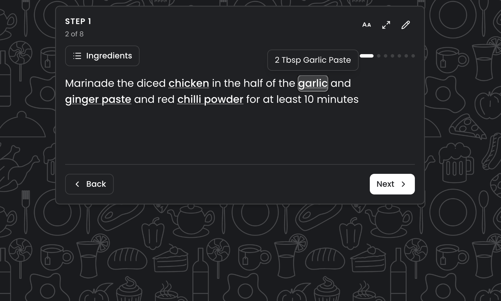

# Pantri



**Live:** [pantri.joescript.io](https://pantri.joescript.io) · Preview: [pantri-dev.joescript.io](https://pantri-dev.joescript.io)  
**Package:** `@joescript/pantri`

## Purpose

A shared pantry for recipes, cooking, and the weekly shop.

Recipes used to live in Google Keep as nested checklists; an accidental drag could break the list. Pantri is the household app that replaced that: recipes, a shopping list that updates on both phones, and a cook view that keeps each step next to the quantities it needs.

The live app holds real household data, so it requires sign-in.

## Architecture

TypeScript and React on Cloudflare Workers. Turso stores the pantry. One Durable Object per pantry manages active connections and notifies connected clients when the list changes. A recipe photo can be read into ingredients with Workers AI. Recipe photos sit in R2.

| Concern | Where |
|---------|--------|
| Schema | `app/db/schema/` |
| Auth (Google) | `app/lib/auth.server.ts` |
| Env validation | `app/lib/env.server.ts` |
| Live list sync | `workers/pantry-hub.ts`, `app/services/realtime.server.ts`, `app/routes/pantry.api.events.tsx` |
| Photos | `app/services/photos.service.ts` |
| Photo → ingredients | `app/services/extract.server.ts` |
| Worker entry | `workers/app.ts` |

**Bindings** (`wrangler.jsonc`): `AI`, `PHOTOS` (R2: `pantri-photos-dev` / `pantri-photos-prod`), `PANTRY_HUB` (Durable Object).

## Decisions

### Copy a recipe onto the list instead of linking it

The same recipe can be shopped twice, each with its own bought ingredients. Editing the recipe afterwards does not change the copy already on the list.

### Keep both phones in sync

Server-sent events notify active clients when the shopping list changes. A normal refetch when the app regains focus restores consistency after a client disconnects.

## Setup

**Requires:** Node 24+, pnpm 11.7, a Turso database, Google OAuth client, Cloudflare account with Workers AI + R2.

```bash
pnpm install
pnpm dev:pantri          # from repo root
# or: pnpm --filter @joescript/pantri dev
```

### `.dev.vars`

| Variable | Required |
|----------|----------|
| `TURSO_DATABASE_URL` | yes |
| `TURSO_AUTH_TOKEN` | usually |
| `BETTER_AUTH_SECRET` | yes (min 32 chars) |
| `BETTER_AUTH_URL` | yes — local origin, e.g. `http://localhost:5173` |
| `GOOGLE_CLIENT_ID` | yes |
| `GOOGLE_CLIENT_SECRET` | yes |

### Google OAuth redirect URIs

Add authorized redirect URIs for each origin you run (Better Auth callback path — confirm against `app/lib/auth.server.ts` if unsure):

- `http://localhost:5173/api/auth/callback/google`
- `https://pantri-dev.joescript.io/api/auth/callback/google`
- `https://pantri.joescript.io/api/auth/callback/google`

Deployed `BETTER_AUTH_URL` is set in `wrangler.jsonc` vars per environment. Put the remaining secrets on the Worker with `wrangler secret put`, matching `.dev.vars`.

### Database

Drizzle Kit uses `.env.migrate.{dev,prod,local}` selected by `PANTRI_MIGRATE_ENV`:

```bash
pnpm db:generate
pnpm db:migrate          # dev
pnpm db:migrate:prod
pnpm db:studio
```

### Useful scripts

| Script | Purpose |
|--------|---------|
| `dev` / `build` / `typecheck` / `test` | Day-to-day |
| `deploy` / `deploy:prod` | Dev Worker / production Worker |
| `import:firestore` / `export:firestore` | One-off Firebase cutover |

## Live link

- **Production:** https://pantri.joescript.io
- **Preview:** https://pantri-dev.joescript.io
- **Portfolio:** https://joescript.io/work/pantri
- **Source:** [`apps/pantri`](https://github.com/BanJoeH/joescript/tree/main/apps/pantri)
